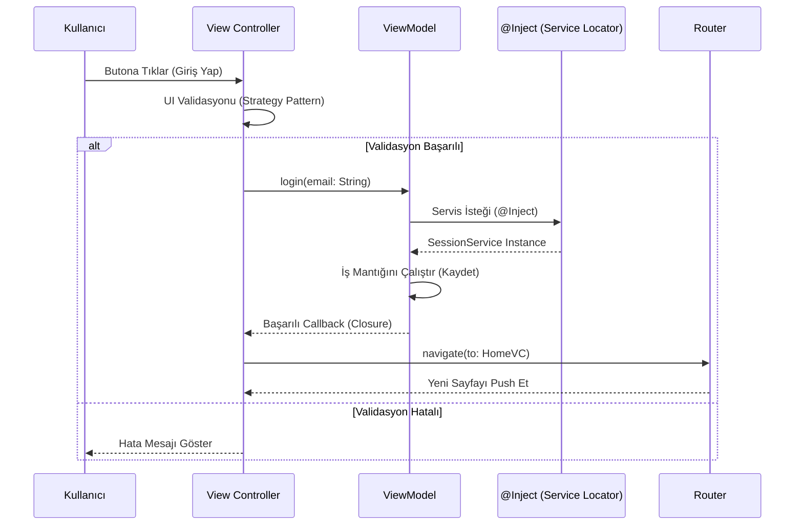
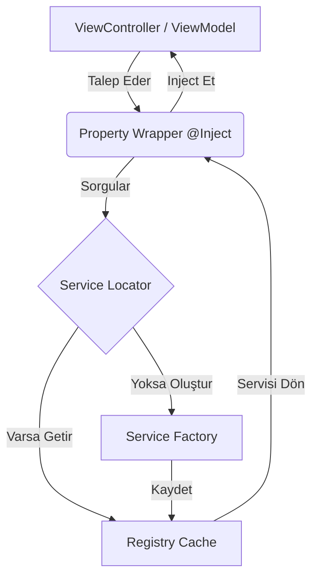

<br>


<br>
<br>


# 🏛️ Advanced Modular iOS Architecture


## ✍️ Mimari İmza ve Referans

Bu proje; **[Yusuf Çınar](https://medium.com/@cinaryusuf)** tarafından tasarlanan ve makalelerinde detaylandırılan modern iOS mimari yaklaşımları (Architecture Signature) birebir uygulanarak hayata geçirilmiştir.

Yusuf Çınar'ın kurumsal ölçekli projeler için geliştirdiği **"Modular Label Design"**, **"Service Locator & DI"** ve **"Router Pattern"** konseptleri bu projenin temelini oluşturur.

---

## 🎯 Projenin Amacı

Kurumsal ölçekli, büyük takımlarla geliştirilen iOS uygulamalarında karşılaşılan **Tight Coupling (Sıkı Bağımlılık)**, **Tekrar Eden Kod (Code Duplication)** ve **Test Edilebilirlik** sorunlarını çözmek amacıyla geliştirilmiş ileri seviye bir mimari şablonudur.

**UIKit (Programmatic UI)** ve **SnapKit** kullanılarak, Clean Code prensiplerine sadık kalınarak inşa edilmiştir.

---

## 🏗️ Mimari ve Akış Diyagramları

Proje, **Separation of Concerns (İlgi Alanlarının Ayrımı)** prensibi üzerine kurulmuştur. Veri, İş Mantığı ve Arayüz birbirinden tamamen izole edilmiştir.

### 1. Genel Veri Akışı (MVVM & Router)

Aşağıdaki diyagram, bir kullanıcının butona bastığı andan itibaren arka planda çalışan akışı özetler:



### 2. Dependency Injection (Bağımlılık Yönetimi)

Servislerin sınıflar içine `new Class()` diyerek gömülmesi yerine, merkezi bir dağıtıcıdan istenmesi prensibidir.



---

## 🚀 Kullanılan Teknolojiler ve Desenler

Bu proje, "Spagetti Kod" oluşumunu engellemek için aşağıdaki tasarım desenlerini (Design Patterns) uygular:

### 1. MVVM (Model-View-ViewModel)

* **Amaç:** UI (View Controller) ile İş Mantığını (ViewModel) ayırmak.
* **Uygulama:** `BaseVC<T>` generic yapısı sayesinde her View Controller, kendi ViewModel'ini otomatik olarak oluşturur.

### 2. Dependency Injection & Service Locator

* **Amaç:** Sınıfların birbirine sıkı sıkıya bağlanmasını engellemek.
* **Uygulama:** `ServiceLocator` sınıfı tüm servisleri (Auth, Network, Storage) tutar. `@Inject` property wrapper'ı ise bu servisleri tek satırda çağırmamızı sağlar.

### 3. Router Pattern (Navigation)

* **Amaç:** Bir ekranın, gideceği diğer ekranı tanımasını engellemek (Loose Coupling).
* **Uygulama:** `navigationController.push(...)` kodları View Controller'dan çıkarılıp, merkezi `Router.shared.navigate(...)` yapısına taşınmıştır.

### 4. Strategy Pattern (UI Components)

* **Amaç:** UI elemanlarının davranışlarını modüler hale getirmek.
* **Uygulama:**
* **Labels:** `LabelStyleProvider` protokolü ile Header, Body gibi stiller dinamik olarak uygulanır.
* **Validation:** `EmailValidator`, `PasswordValidator` gibi kurallar `ValidationProvider` üzerinden `FormField` bileşenine enjekte edilir.


### 5. Property Wrappers (Storage)

* **Amaç:** UserDefaults ve Keychain gibi veri saklama işlemlerindeki kod kirliliğini önlemek.
* **Uygulama:** `@UserDefaultsStorage(key: "token")` etiketi ile veriler otomatik kaydedilir/okunur.

---

## 📂 Klasör Yapısı

Proje, modülerliği destekleyen bir klasör yapısına sahiptir:

```text
ModularArchitectureApp
├── Core                 # Uygulamanın Beyni (İş mantığından bağımsız altyapı)
│   ├── DI               # Service Locator ve Inject Wrapper
│   ├── Storage          # UserDefaults ve Keychain Yöneticileri
│   └── Router           # Navigasyon Yöneticisi
├── UIComponents         # Tekrar Kullanılabilir Görsel Bileşenler
│   ├── Labels           # Strateji deseni ile stillendirilmiş Label'lar
│   └── FormFields       # Validasyon yeteneği olan Input alanları
├── Scenes               # Uygulama Ekranları
│   ├── Base             # BaseVC ve BaseVM (Generic altyapı)
│   └── Login            # Örnek Login Modülü (VC ve VM)
└── App                  # AppDelegate ve SceneDelegate (Composition Root)

```

---

<br>


## 📝 Nasıl Kullanılır?

### Yeni Bir Servis Eklemek

```swift
// 1. Protokolü tanımla
protocol NetworkServiceProtocol { ... }

// 2. SceneDelegate içinde kaydet
ServiceLocator.shared.register(NetworkService() as NetworkServiceProtocol)

// 3. İstediğin yerde kullan
@Inject var networkService: NetworkServiceProtocol

```

### Yeni Bir Ekran Eklemek

```swift
// 1. ViewModel oluştur
class HomeVM: BaseVM { ... }

// 2. ViewController oluştur (Generic yapı otomatik bağlar)
class HomeVC: BaseVC<HomeVM> { ... }

```

---

## 📚 Kaynaklar ve Teşekkür

Bu projenin mimari altyapısı, **[Yusuf Çınar](https://www.google.com/url?sa=E&source=gmail&q=https://medium.com/@cinaryusuf)** tarafından yazılan aşağıdaki makaleler temel alınarak oluşturulmuştur:

* [Swift ile Modüler UILabel Tasarımı](https://www.google.com/url?sa=E&source=gmail&q=https://medium.com/@cinaryusuf)
* [Dependency Injection ve Service Locator Deseni](https://www.google.com/url?sa=E&source=gmail&q=https://medium.com/@cinaryusuf)
* [iOS Uygulamalarında Router ve Veri Transferi Yönetimi](https://www.google.com/url?sa=E&source=gmail&q=https://medium.com/@cinaryusuf)
* [Swift ile Property Wrapper Kullanarak Storage Yapısı](https://www.google.com/url?sa=E&source=gmail&q=https://medium.com/@cinaryusuf)

---

**Uygulayan Geliştirici: Uğur Hamzaoğlu**


